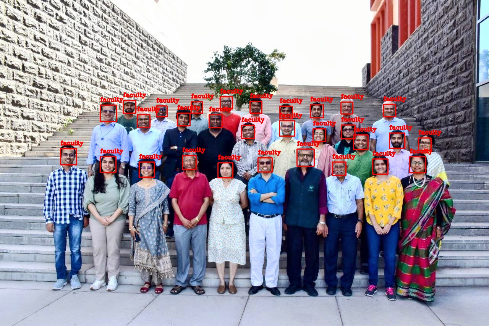
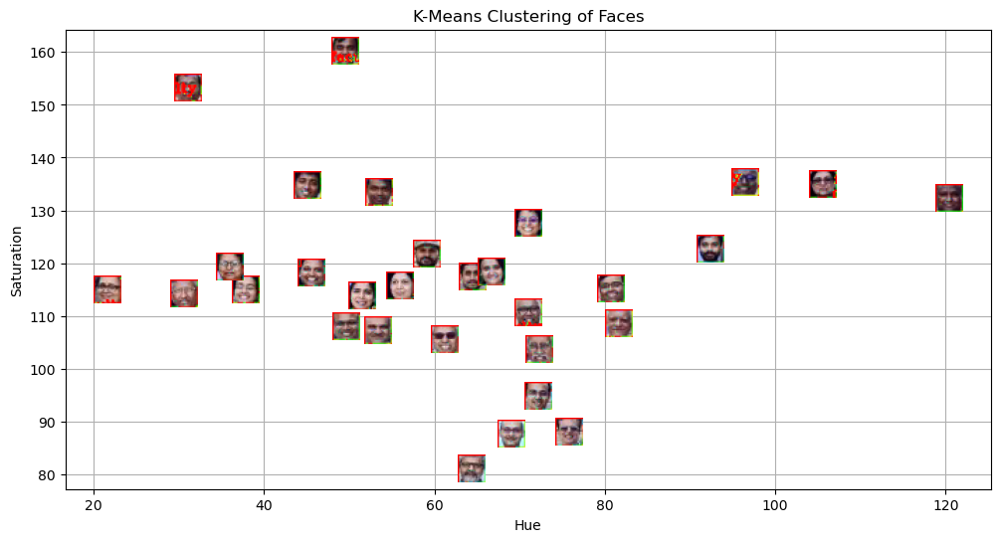
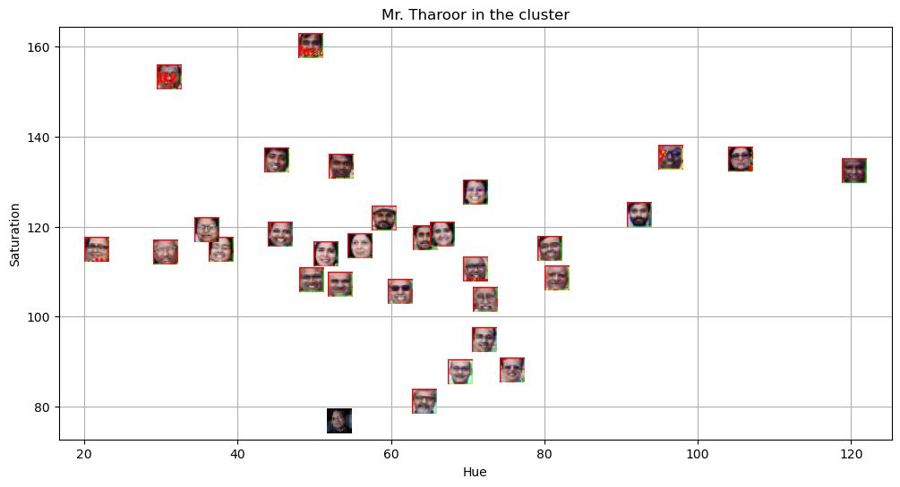
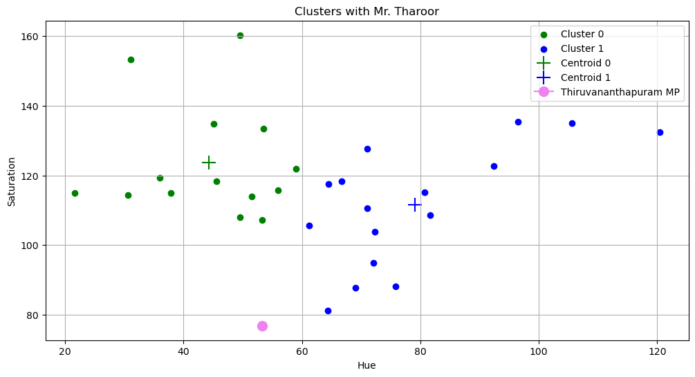

# Face Classification using K-Means Clustering

## Aim

This lab focuses on implementing distance-based classification using K-Means clustering for face classification. The main objectives were:
- Detect faces in a group photograph 
- Extract color features (Hue and Saturation) from detected faces
- Apply K-Means clustering to group similar faces
- Classify Mr. Tharoor's face into the appropriate cluster

## Methodology

### Face Detection
Used Haar Cascade Classifier with the following parameters:
- scaleFactor: 1.05
- minNeighbors: 4
- minSize: (25, 25), maxSize: (50, 50)

Converted images to grayscale before detection and drew rectangles around detected faces.

### Feature Extraction
- Converted BGR images to HSV color space
- Extracted mean Hue and Saturation values for each face region
- These features represent color characteristics of faces

### Clustering
- Applied K-Means with K=2 clusters
- Used scikit-learn's KMeans implementation
- Fit the model on (Hue, Saturation) feature pairs
- Obtained cluster labels and centroids

### Classification
- Loaded reference image of Mr. Tharoor
- Extracted same Hue-Saturation features
- Calculated distances to both cluster centroids
- Assigned to nearest cluster

## Key Findings

### Detection Results
Successfully detected multiple faces in the faculty group photo. Haar Cascade worked well with the tuned parameters.

### Clustering Results
The K-Means algorithm separated faces into two distinct clusters based on their color features:
- Cluster 0: Faces with certain Hue-Saturation characteristics
- Cluster 1: Faces with other Hue-Saturation characteristics

Clear separation was visible in the 2D feature space.

### Target Classification
Mr. Tharoor's face was successfully classified into one of the clusters based on Euclidean distance to centroids.

## Visualizations

### Face Detection Output

### K-Means Clustering Result

### Target Classification

### Target plotted along with the Clusters

## Conclusions

K-Means clustering successfully grouped faces based on Hue and Saturation features. The algorithm effectively separated faces into two clusters with clear boundaries in the feature space.

The main findings:
- Color-based features (Hue and Saturation) can distinguish between different faces
- K-Means provides clear cluster assignments based on Euclidean distance
- The target face was correctly classified into the appropriate cluster

Some limitations observed:
- Only color features were used, which may not capture all facial characteristics
- K=2 was predetermined; optimal K could be found using elbow method
- Results may vary with different lighting conditions

Overall, the distance-based classification approach using K-Means proved effective for this face grouping task.
